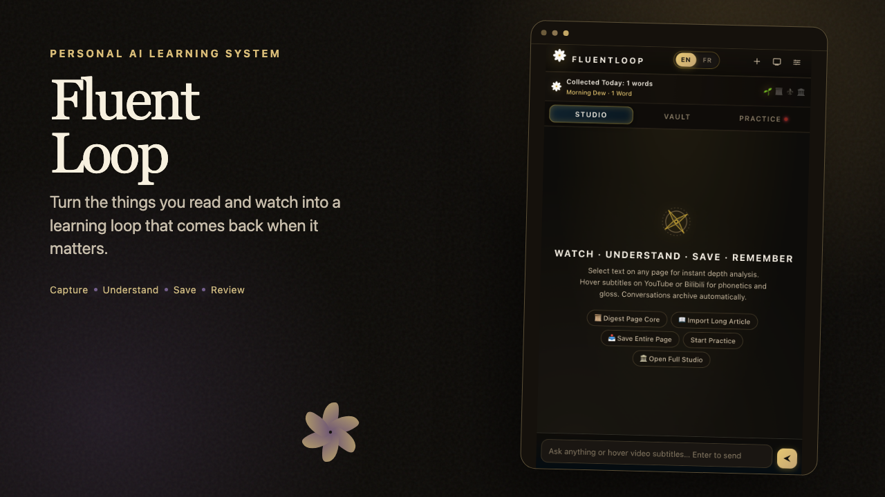
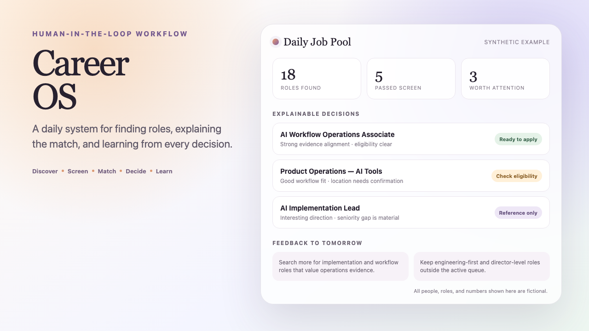
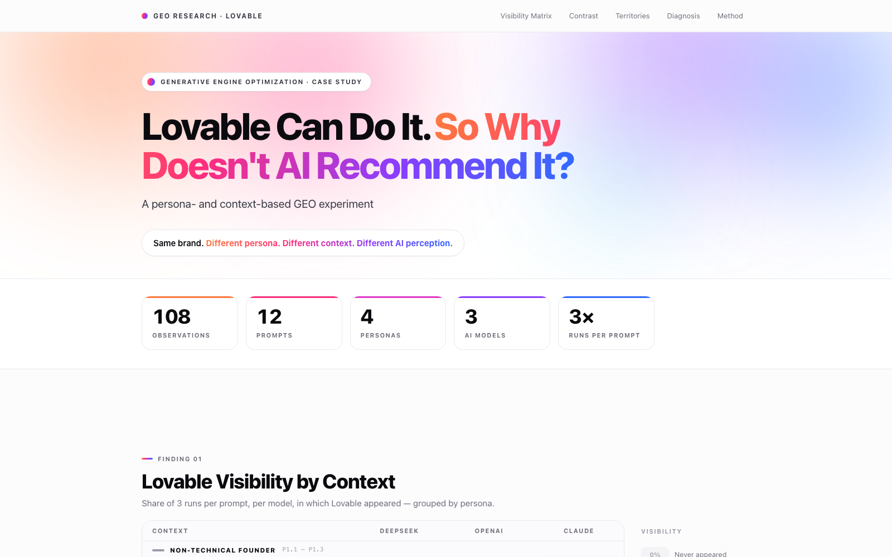

# Keer Deng / 邓可而

<p>
  <a href="https://studiokeer.com"></a>
  <a href="https://www.linkedin.com/in/keer-deng-/"></a>
  <a href="mailto:keer.deng.paris@gmail.com"></a>
</p>


AI workflow designer and operator building practical systems for messy, judgment-heavy work.

I tend to notice small frictions: a job search that repeats every morning, a sentence that interrupts the flow of reading, or a lead list nobody fully trusts.

Then I start building.

Some experiments become personal tools. Some grow into reusable workflows. The ones that last usually have the same shape: clear evidence, simple rules, AI where it helps, human judgment where it matters, and a feedback loop that makes the system better over time.

I am currently exploring **AI workflow consulting**, **personal AI systems**, and how language models are changing the way people discover products and information.

## Selected Systems

<table>
  <tr>
    <td width="50%" valign="top">
      <a href="https://github.com/keer-d/fluentloop"></a><br>
      <b>FluentLoop</b><br>
      <sub>A local-first Chrome extension that turns webpages and video subtitles into a personal language-learning loop.</sub><br><br>
      <sub><a href="https://github.com/keer-d/fluentloop">Repository</a> · <a href="https://www.youtube.com/watch?v=Z0oLShLFesw">Watch demo</a></sub>
    </td>
    <td width="50%" valign="top">
      <a href="https://github.com/keer-d/career-os"></a><br>
      <b>CareerOS</b><br>
      <sub>A privacy-safe case study of a daily workflow for job discovery, explainable matching, applications, and feedback.</sub><br><br>
      <sub><a href="https://github.com/keer-d/career-os">Repository</a> · Synthetic examples, real system design</sub>
    </td>
  </tr>
</table>

### Research experiment

<a href="https://www.youtube.com/watch?v=DE7pMZPA0jU"></a>

**Lovable GEO Experiment** — a reproducible case study of how persona and prompt context change brand visibility across language models. [Watch the case study](https://www.youtube.com/watch?v=DE7pMZPA0jU); the public research repository is in progress.

### System taking shape

- **LeadGen Framework** — an evidence-first framework for multi-channel lead discovery, qualification, pilot testing, and sales feedback loops.

## How I Build

```text
Business problem
    ↓
Workflow diagnosis
    ↓
Evidence & decision rules
    ↓
AI assistance
    ↓
Human review
    ↓
Working system
    ↓
Feedback & iteration
```

I am less interested in automating everything than in finding the right boundary: what a model can accelerate, what needs a clear rule, and what should remain a human decision.

## What I Build Here

- **AI workflow systems** for research, qualification, matching, and recurring operational work.
- **Personal AI tools** that I use myself long enough to discover what is actually useful.
- **Human-in-the-loop decision systems** where outputs stay explainable and reviewable.
- **Small experiments** around GEO, LLM evaluation, and AI-mediated discovery.
- **Interfaces for invisible work** — dashboards and visual systems that make a workflow easier to understand and improve.

## Questions I’m Exploring

- How small can an AI system be and still meaningfully improve someone’s day?
- What should remain a human decision, even when automation is possible?
- How can a workflow learn from mistakes instead of simply producing more output?
- What happens when AI recommendations become a new layer of product discovery?
- Can a personal tool grow into a useful method for a team?

## Background

My background crosses international operations, growth, customer research, and AI-assisted workflow design. I am not trying to become a traditional software engineer. I work from the problem first: understand the task, define the judgment, build a practical system, use it, and keep refining it.

I am building toward a consulting practice for teams that have important workflows still held together by repetitive searches, scattered documents, manual judgment, and knowledge that never quite makes it back into the process.

## Work With Me

If you are exploring a workflow that could become clearer, lighter, or more useful with AI, you can find more of my work at **[StudioKeer](https://studiokeer.com)** or reach me on **[LinkedIn](https://www.linkedin.com/in/keer-deng-/)**.
